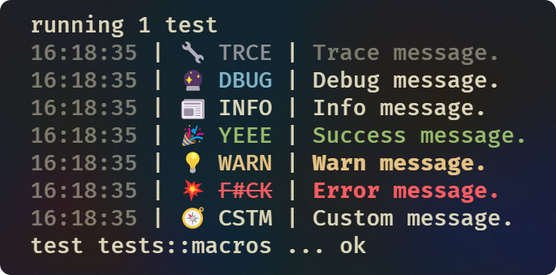

# Logi - A less boring logger

A modern, cool and nice looking logger for better DX on your CLI apps.

<div align="center">
    
</div>

<br/>

---

> [!NOTE]
> This library is a WIP. I do use this in some of my own projects so `main` should be stable.

---

<br/>

## Why?

Log is a essential part of any CLI app. It's how you'll communicate with your users. And you don't want to flood them with useless information. You also need your logs to be easy to read and of easy recognizability. If the user has to rewind and think every time they see a log, it's not a good log.

And of course, we want all of this without having to write a lot of code. We want something that's familiar and easy to use also for the developers.

This library was created to solve these problems. It's easy to use and it's easy to read.

## How?

It uses a pattern of `hour:minute:second | icon type | message`. The icon is a emoji* that represents the type of log. The type is a 4-letter colored word that represents the type of log. And the message is the final log message colored to match the type.

<details>
<summary>For the user:</summary>

The user output is designed to be easy to read. It means it's easy to recognize the type of log and it's easy to read the message.

Example:

```md
14:58:22 | 🔧 TRCE | Trace message.
14:58:22 | 🔮 DBUG | Debug message.
14:58:22 | 📰 INFO | Info message.
14:58:22 | 🎉 YEEE | Success message.
14:58:22 | 💡 WARN | Warn message.
14:58:22 | 💥 F#CK | Error message.
14:58:22 | 🧭 CSTM | Custom message.
```

</details>

<details>
<summary>For the developer:</summary>

The developer API was designed to be familiar and easy to use. It means it's really close to the `std` Rust logger.

Example:

```rust
trace!("Trace message.");           // 00:00:00 | 🔧 TRCE | Trace message.
debug!("Debug message.");           // 00:00:00 | 🔮 DBUG | Debug message.
info!("Info message.");             // 00:00:00 | 📰 INFO | Info message.
success!("Success message.");       // 00:00:00 | 🎉 YEEE | Success message.
warn!("Warn message.");             // 00:00:00 | 💡 WARN | Warn message.
error!("Error message.");           // 00:00:00 | 💥 F#CK | Error message.
custom!("🧭 CSTM", "Custom one.");  // 20:39:24 | 🧭 CSTM | Custom message.
```

</details>

## Usage

Add this to your `Cargo.toml`:

```toml
[dependencies]
logi = "x.x.x" # Just replace `x.x.x` with the latest release.
```

And this to your main file:

```rust
#[macro_use]
extern crate logi;
```

## License

This project is licensed under the Apache-2.0 license. See the [LICENSE](https://www.apache.org/licenses/LICENSE-2.0.txt) file for more details.
